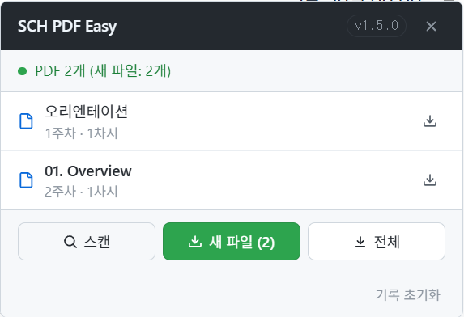

# SCH PDF Easy Downloader

**지금 강의자료실에서 약간의 버그가 있어서 강의콘텐츠만 서비스 지원합니다**

순천향대학교 LMS([medlms.sch.ac.kr](https://medlms.sch.ac.kr))의 강의 자료를 일괄 다운로드하는 Chrome 확장 프로그램입니다.



---

## 기능

- **두 가지 페이지 타입 지원**
  - 강의콘텐츠와 강의자료실에 접속하면 자동으로 우측 하단에 확장 프로그램 버튼이 나타납니다.
- **PDF,PPT,PPTX**
  - 세 가지 종류의 파일을 모두 탐지하고 다운로드까지 지원합니다.
- **최대 5개 병렬 다운로드**
  - 최대 5개의 파일을 동시에 다운로드하고, 진행 상황 바를 통해 실시간으로 진행 상황을 파악할 수 있습니다.
- **다운로드 기록 관리**
  - 이미 받은 파일과 새 파일을 구분하고, 세션 간 상태를 유지합니다.
  - 이미 받은 파일은 건너뜁니다. (전체 다운로드 시 모든 파일을 다운로드합니다.)
---

## 설치

빌드 과정 없음.

1. [Releases](https://github.com/fox5t4r/sch-pdf-easy/releases) 페이지에서 최신 zip 다운로드
2. 압축 해제
3. Chrome → `chrome://extensions` → **개발자 모드** 활성화
4. **압축해제된 확장 프로그램을 로드합니다** → 압축 해제한 폴더 선택

또는 클론 후 바로 로드:

```bash
git clone https://github.com/fox5t4r/sch-pdf-easy.git
```

추후 크롬 확장 프로그램에 정식으로 출시 예정입니다.(현재 제출했고 검수 중입니다.)

---

## 사용법

1. [medlms.sch.ac.kr](https://medlms.sch.ac.kr)에 로그인 후 강의의 **강의콘텐츠** 또는 **강의자료실** 페이지 접속
2. 우측 하단 **PDF** 버튼 클릭 — 패널이 열리면서 자동으로 스캔 시작
3. **새 파일** — 아직 받지 않은 파일만 다운로드 / **전체** — 전부 다운로드
4. 파일은 `다운로드/SCH_PDF/` 폴더에 저장됨

스캔이 실패하면 **스캔** 버튼으로 수동 재시도.

---

## 파일 구조

```
sch-pdf-easy/
├── manifest.json      # MV3 설정 — 권한, 콘텐츠 스크립트
├── background.js      # Service Worker — chrome.downloads, chrome.storage
├── content.js         # Isolated world — UI 패널, 스캔 조율, 다운로드 로직
├── injector.js        # MAIN world — React Fiber 탐색, Redux 접근, DOM 폴백
├── style.css          # 확장 프로그램 UI 스타일
└── icons/
    ├── icon16.png
    ├── icon48.png
    └── icon128.png
```

**동작 흐름:**

```
content.js  ──(CustomEvent '__SPE_SCAN_REQUEST')──▶  injector.js
                                                          │
                                               강의콘텐츠: Redux Store 탐색
                                               강의자료실: DOM 스캔
                                                          │
content.js  ◀─(CustomEvent '__SPE_SCAN_RESULT')───────────┘
    │
    ├─ Canvas File API 결과와 병합 (contentId 기준 중복 제거)
    └─ 다운로드 요청 ──▶ background.js ──▶ chrome.downloads
```

---

## 권한

| 권한 | 용도 |
|---|---|
| `downloads` | 파일을 `download/SCH_PDF/`에 저장 |
| `storage` | 다운로드 기록 세션 간 유지 |
| `activeTab` | 현재 LMS 탭의 DOM 접근 |
| `medlms.sch.ac.kr/*` | 강의 페이지 스캔, Canvas File API 호출 |
| `commons.sch.ac.kr/*` | 콘텐츠 다운로드 URL 조회 (content.php API) |

---

## 주의사항

- 순천향대학교 LMS 전용. 반드시 로그인된 상태에서 사용.
- 서버 측 접근 제한이 있는 파일은 다운로드되지 않음.

## 라이선스

MIT
