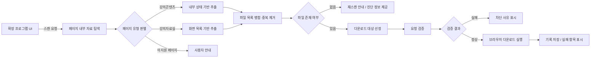

# SCH PDF Easy Downloader


순천향대학교 LMS에서 강의자료를 과목별로 하나씩 내려받아야 하는 불편을 줄이기 위해 만든 Chrome 확장 프로그램입니다.

강의콘텐츠와 강의자료실을 자동 스캔하여 PDF, PPT, PPTX 파일을 탐지하고, 새 파일만 골라 원클릭으로 최대 5개까지 병렬 다운로드합니다.


 
---

## 30초 소개

이 프로젝트는 순천향대학교 LMS([medlms.sch.ac.kr](https://medlms.sch.ac.kr))에서 강의자료를 반복적으로 직접 내려받아야 하는 문제를 해결하기 위해 만든 Chrome 확장 프로그램입니다.

저는 이 프로젝트에서 기획, LMS 구조 분석, Chrome Extension 설계, 파일 탐지 로직 구현, 다운로드 처리, 테스트, 배포를 단독으로 진행했습니다.

핵심 기술로는 Chrome Extension Manifest V3, Content Script, Background Service Worker, MAIN world Injector를 사용했습니다. 이를 통해 LMS 페이지 내부의 자료 정보를 탐색하고, 다운로드 요청을 검증한 뒤 브라우저 다운로드 API로 안전하게 저장하도록 구현했습니다.

---

## Demo / 실행 링크

| 항목            | 링크                                                                    |
| ------------- | --------------------------------------------------------------------- |
| Demo GIF      | [`docs/demo.gif`](./docs/demo.gif)                                    |
| Screenshot    | [`screenshot.png`](./screenshot.png)                                  |
| 실행 파일         | [GitHub Releases](https://github.com/fox5t4r/sch-pdf-easy/releases)   |
| Source Code   | [GitHub Repository](https://github.com/fox5t4r/sch-pdf-easy)          |
| Issues        | [GitHub Issues](https://github.com/fox5t4r/sch-pdf-easy/issues)       |
| Pull Requests | [GitHub Pull Requests](https://github.com/fox5t4r/sch-pdf-easy/pulls) |


---

## 핵심 기능

### 1. 강의자료 자동 탐지

강의콘텐츠와 강의자료실 페이지에 접속하면 확장 프로그램 버튼이 나타나고, PDF, PPT, PPTX 파일을 자동으로 탐지합니다.

### 2. 새 파일만 선택 다운로드

이미 다운로드한 파일과 새로 올라온 파일을 구분합니다.
새 파일만 다운로드하거나, 필요하면 전체 파일을 다시 다운로드할 수 있습니다.

### 3. 안정적인 병렬 다운로드

최대 5개 파일을 동시에 다운로드합니다.
개별 파일 다운로드가 실패하더라도 전체 작업이 중단되지 않도록 실패 항목을 분리해 표시합니다.

---

## 시스템 아키텍처



확장 프로그램 UI는 사용자의 스캔/다운로드 요청을 처리하고, 페이지 내부 자료 탐색 계층은 LMS 페이지 유형에 따라 파일 정보를 추출합니다. 추출된 파일 목록은 병합 및 중복 제거를 거치며, 다운로드 단계에서는 URL과 파일명을 검증한 뒤 브라우저 다운로드 API를 호출합니다.

---

## 기술 스택

| 영역              | 기술                                                | 사용 이유                                                                   |
| --------------- | ------------------------------------------------- | ----------------------------------------------------------------------- |
| Extension       | Chrome Extension Manifest V3                      | Chrome 확장 프로그램의 최신 권한 모델과 Service Worker 구조를 사용하기 위해 선택                 |
| Language        | JavaScript                                        | LMS 페이지의 DOM, React 내부 데이터, Chrome Extension API를 직접 다루기 위해 사용          |
| UI Layer        | Content Script, CSS                               | LMS 페이지 위에 확장 프로그램 패널을 표시하고 사용자 입력을 처리하기 위해 사용                          |
| Page Analysis   | MAIN world Injector                               | Content Script의 isolated world 제약 때문에 페이지 내부 React/Redux 상태에 접근하기 위해 사용 |
| Background Task | Background Service Worker                         | 다운로드 요청 검증, 다운로드 실행, 기록 저장을 UI와 분리하기 위해 사용                              |
| Browser API     | `chrome.downloads`, `chrome.storage`, `activeTab` | 파일 저장, 다운로드 기록 유지, 현재 LMS 탭 접근을 위해 사용                                   |
| Data Extraction | React/Redux 탐색, DOM fallback                      | LMS 페이지 구조 차이와 변경 가능성에 대응하기 위해 사용                                       |
| Quality         | Node.js test runner, GitHub Actions               | 문법 검사와 테스트를 자동화하기 위해 사용                                                 |

---

## 파일 구조

```text
sch-pdf-easy/
├── manifest.json      # MV3 설정, 권한, 콘텐츠 스크립트 등록
├── background.js      # 다운로드 요청 검증, chrome.downloads, chrome.storage 처리
├── content.js         # 확장 UI, 사용자 이벤트, 스캔/다운로드 흐름 조율
├── injector.js        # 페이지 내부 자료 탐색, React/Redux 접근, DOM fallback
├── shared.js          # 공통 유틸리티
├── style.css          # 확장 프로그램 UI 스타일
├── test/              # 테스트 코드
├── .github/
│   └── workflows/     # CI 설정
└── icons/
    ├── icon16.png
    ├── icon48.png
    └── icon128.png
```

---

## 설치 및 실행

### 1. Releases에서 설치

1. [Releases](https://github.com/fox5t4r/sch-pdf-easy/releases) 페이지에서 최신 zip 파일을 다운로드합니다.
2. 압축을 해제합니다.
3. Chrome 주소창에 아래 주소를 입력합니다.

```text
chrome://extensions
```

4. 우측 상단의 개발자 모드를 활성화합니다.
5. “압축해제된 확장 프로그램을 로드합니다”를 클릭합니다.
6. `manifest.json`이 있는 프로젝트 폴더를 선택합니다.

### 2. 로컬에서 클론 후 실행

```bash
git clone https://github.com/fox5t4r/sch-pdf-easy.git
cd sch-pdf-easy
npm install
npm run lint:syntax
npm test
```

테스트가 통과하면 Chrome에서 아래 순서로 로드합니다.

```text
chrome://extensions
→ 개발자 모드 활성화
→ 압축해제된 확장 프로그램을 로드합니다
→ manifest.json이 있는 프로젝트 루트 폴더 선택
```

이 프로젝트는 별도의 빌드 과정 없이 Chrome Extension 폴더를 바로 로드하는 방식으로 실행합니다.

---

## 사용법

1. [medlms.sch.ac.kr](https://medlms.sch.ac.kr)에 로그인합니다.
2. 강의의 강의콘텐츠 또는 강의자료실 페이지에 접속합니다.
3. 우측 하단 PDF 버튼을 클릭합니다.
4. 패널이 열리면 자동으로 강의자료 스캔이 시작됩니다.
5. 새 파일만 받으려면 “새 파일”을 클릭합니다.
6. 전체 파일을 다시 받으려면 “전체”을 클릭합니다.
7. 파일은 아래 경로에 저장됩니다.

```text
다운로드/SCH_PDF/
```

스캔이 실패하면 패널의 “스캔” 버튼을 눌러 수동으로 다시 시도할 수 있습니다.

---

## 권한

| 권한                    | 용도                         |
| --------------------- | -------------------------- |
| `downloads`           | 파일을 `다운로드/SCH_PDF/` 경로에 저장 |
| `storage`             | 다운로드 기록을 브라우저에 저장          |
| `activeTab`           | 현재 열려 있는 LMS 탭에 접근         |
| `medlms.sch.ac.kr/*`  | 강의 페이지 스캔 및 파일 정보 조회       |
| `commons.sch.ac.kr/*` | 콘텐츠 다운로드 URL 조회            |

이 확장 프로그램은 별도의 외부 서버로 사용자 데이터를 전송하지 않습니다. 다운로드 기록은 브라우저 내부 저장소를 사용합니다.

---

## 기술적 의사결정 기록

기술 선택은 단순히 “무엇을 사용했는가”가 아니라, 상황, 대안, 선택 기준, 결정, 결과와 한계를 기준으로 기록했습니다.

### 1. Content Script와 MAIN world Injector 분리

#### 상황

Chrome Extension의 Content Script는 isolated world에서 실행되기 때문에 페이지 내부의 React/Redux 상태에 직접 접근하기 어렵습니다.
하지만 LMS의 파일 정보는 단순 DOM 링크만으로는 충분히 얻기 어려운 경우가 있었습니다.

#### 대안

* Content Script에서 DOM만 스캔한다.
* Content Script에서 직접 React/Redux 객체에 접근한다.
* MAIN world에서 실행되는 별도 탐색 계층을 두고, Content Script와 이벤트로 통신한다.

#### 선택 기준

* LMS 내부 데이터 접근 가능성
* Chrome Extension 보안 모델 준수
* 유지보수성
* 기능 확장성

#### 결정

확장 프로그램 UI와 사용자 이벤트는 Content Script가 담당하고, LMS 페이지 내부 자료 탐색은 MAIN world에서 실행되는 탐색 계층이 담당하도록 분리했습니다.

#### 결과

Content Script의 isolated world 제약을 피하면서도 LMS 내부 데이터 탐색이 가능해졌습니다.
또한 UI 처리와 자료 탐색 책임이 분리되어 유지보수가 쉬워졌습니다.

#### 한계

LMS 프론트엔드 구조가 변경되면 페이지 내부 자료 탐색 로직도 수정이 필요합니다.

---

### 2. React/Redux 탐색과 DOM fallback 병행

#### 상황

강의콘텐츠와 강의자료실은 파일 정보를 제공하는 방식이 서로 달랐습니다.
일부 자료는 화면에 보이는 정보와 실제 다운로드에 필요한 내부 식별자가 달라 단순 DOM 스캔만으로는 정상 다운로드가 어려웠습니다.

#### 대안

* DOM에 보이는 링크만 수집한다.
* React/Redux 내부 데이터만 탐색한다.
* 내부 데이터 탐색을 우선하고 실패 시 DOM fallback을 사용한다.

#### 선택 기준

* 다운로드 성공률
* LMS 구조 변경 대응력
* 구현 복잡도
* 유지보수성

#### 결정

React/Redux 내부 데이터 탐색을 우선하고, 실패 시 DOM fallback을 수행하도록 설계했습니다.

#### 결과

단순 DOM 스캔보다 실제 다운로드 가능한 파일 정보를 더 안정적으로 얻을 수 있었습니다.
또한 특정 구조에서 내부 데이터 탐색이 실패해도 DOM 기반으로 최소한의 파일 탐지를 유지할 수 있었습니다.

#### 한계

React/Redux 내부 구조에 의존하는 부분은 LMS 업데이트에 취약할 수 있습니다.

---

### 3. 최대 5개 병렬 다운로드 제한

#### 상황

여러 강의자료를 한 번에 다운로드할 때 모든 파일을 동시에 요청하면 브라우저 다운로드 큐, LMS 서버 응답, 사용자 네트워크 상태에 따라 실패 가능성이 커질 수 있었습니다.

#### 대안

* 모든 파일을 동시에 다운로드한다.
* 파일을 하나씩 순차 다운로드한다.
* 제한된 개수만 병렬 다운로드한다.

#### 선택 기준

* 다운로드 속도
* 실패율
* 서버 부하
* 사용자 경험
* 구현 복잡도

#### 결정

최대 5개 파일만 동시에 다운로드하도록 제한했습니다.

#### 결과

순차 다운로드보다 빠르면서도, 무제한 병렬 다운로드보다 안정적인 다운로드 흐름을 만들 수 있었습니다.

#### 한계

사용자 네트워크 환경이나 LMS 서버 상태에 따라 최적의 동시성 값은 달라질 수 있습니다.

---

### 4. Chrome Storage를 이용한 다운로드 기록 관리

#### 상황

이미 다운로드한 파일과 새로 올라온 파일을 구분하기 위해 다운로드 기록을 저장해야 했습니다.

#### 대안

* LocalStorage 사용
* Chrome Storage 사용
* 외부 서버에 사용자 기록 저장

#### 선택 기준

* 개인정보 보호
* Chrome Extension API와의 호환성
* 구현 복잡도
* 유지보수성

#### 결정

Chrome Extension 환경에 적합한 `chrome.storage`를 사용했습니다.

#### 결과

외부 서버 없이 사용자의 브라우저 내부에서 다운로드 기록을 관리할 수 있었습니다.
background service worker와 content script 간 데이터 공유도 쉬웠습니다.

#### 한계

브라우저 데이터 삭제나 확장 프로그램 제거 시 기록이 사라질 수 있습니다.

---

### 5. 다운로드 요청 검증

#### 상황

확장 프로그램은 `chrome.downloads` API를 사용해 브라우저 다운로드를 실행합니다.
이때 검증 없이 임의 URL을 다운로드하면 의도하지 않은 외부 요청이나 악성 URL 다운로드로 이어질 수 있습니다.

#### 대안

* 모든 URL 다운로드 허용
* 파일 확장자만 검사
* 허용된 LMS 관련 도메인만 다운로드 허용

#### 선택 기준

* 보안성
* 기능 정상 동작
* 구현 복잡도
* 오탐 가능성

#### 결정

다운로드 대상 URL을 LMS 관련 도메인으로 제한하고, 파일명 정규화를 적용했습니다.

#### 결과

확장 프로그램이 의도한 LMS 자료 다운로드 목적을 벗어나지 않도록 제한할 수 있었습니다.

#### 한계

LMS가 파일 제공 도메인을 변경하거나 CDN 도메인을 추가하면 허용 도메인 목록을 업데이트해야 합니다.

---

## Troubleshooting

### 버튼이 보이지 않음

* LMS에 로그인되어 있는지 확인합니다.
* 강의콘텐츠 또는 강의자료실 페이지인지 확인합니다.
* 페이지를 새로고침한 뒤 다시 시도합니다.

### 파일이 검색되지 않음

* 자료 형식이 PDF, PPT, PPTX인지 확인합니다.
* LMS 페이지 로딩이 끝난 뒤 스캔 버튼을 다시 누릅니다.
* 강의콘텐츠와 강의자료실 페이지를 각각 확인합니다.

### 일부 파일만 실패함

* 서버 측 접근 제한이 있는 파일은 다운로드되지 않을 수 있습니다.
* 브라우저에서 해당 파일을 직접 열 수 있는지 확인합니다.
* 실패 항목이 표시되면 해당 항목만 다시 시도합니다.

### 다운로드가 0KB로 저장됨

* 최신 Releases 버전을 사용 중인지 확인합니다.
* 기존 확장 프로그램을 삭제하고 최신 zip을 다시 로드합니다.
* 동일 문제가 반복되면 진단 정보를 복사해 Issue에 첨부합니다.

### 기록을 초기화하고 싶음

* 패널의 기록 초기화 기능을 사용합니다.
* 다운로드된 실제 파일은 삭제되지 않고, 브라우저에 저장된 다운로드 기록만 초기화됩니다.

---

## Repository Hygiene

공개 레포에 불필요한 로컬 파일과 패키징 산출물이 포함되지 않도록 관리합니다.

### 현재 `.gitignore`에서 제외 중인 항목

```gitignore
.DS_Store
*.crx
*.pem
*.zip
node_modules/
.idea/
.vscode/
```

### 추가로 제외를 권장하는 항목

현재 프로젝트에는 별도 빌드 산출물이 없지만, 추후 패키징이나 테스트 환경이 확장될 경우 아래 항목을 `.gitignore`에 추가할 수 있습니다.

```gitignore
# Build / test outputs
build/
dist/
out/
coverage/

# Environment variables
.env
.env.*
!.env.example

# Secrets / keys / certificates
*.key
*.p12
*.crt
*.cert
secrets/
.secret/
.tokens/
token.json
tokens.json
*secret*.json
*token*.json
```

### 로컬 정리 명령어

삭제 대상을 먼저 확인합니다.

```bash
git clean -ndX
```

문제가 없으면 `.gitignore`에 등록된 파일만 삭제합니다.

```bash
git clean -fdX
```

주의: 아래 명령어는 ignore되지 않은 개인 파일까지 삭제할 수 있으므로 사용하지 않습니다.

```bash
git clean -fdx
```

### 민감정보 점검

현재 추적 파일에서 의심 문자열을 검색합니다.

```bash
git grep -nEi "api[_-]?key|secret|token|password|passwd|private[_-]?key|client[_-]?secret|authorization|bearer"
```

전체 히스토리에서 의심 문자열을 검색합니다.

```bash
git log -p --all -G "api[_-]?key|secret|token|password|passwd|private[_-]?key|client[_-]?secret|authorization|bearer"
```

파일명 기준으로도 검사합니다.

```bash
git log --all --name-only --pretty=format: | sort -u | grep -Ei "\.env|key|token|secret|pem|p12|crt|cert"
```

---

## Git 관리 기준

### `.gitignore`

이 프로젝트는 Chrome Extension + JavaScript + Node.js 테스트 환경에 맞춰 다음 파일을 Git에서 제외합니다.

```gitignore
# OS
.DS_Store
Thumbs.db

# Dependencies
node_modules/

# Build / test outputs
build/
dist/
out/
coverage/

# Packaged Chrome extension
*.crx
*.zip

# Environment variables
.env
.env.*
!.env.example

# Secrets / keys / certificates
*.pem
*.key
*.p12
*.crt
*.cert
secrets/
.secret/
.tokens/
token.json
tokens.json
*secret*.json
*token*.json

# IDE
.idea/
.vscode/
```

---

## Commit Convention

이 프로젝트는 작업 단위를 명확히 나누기 위해 Conventional Commit 형식을 사용합니다.

커밋은 단순한 저장 기록이 아니라, 작업을 어떻게 분해하고 관리했는지를 보여주는 기록입니다.
따라서 하나의 커밋에는 하나의 목적만 담는 것을 원칙으로 합니다.

### Format

```text
type: subject
```

### Type

| Type       | Description               |
| ---------- | ------------------------- |
| `feat`     | 기능 추가                     |
| `fix`      | 오류 수정                     |
| `docs`     | 문서 변경                     |
| `style`    | 코드 스타일 변경                 |
| `design`   | 사용자 UI 디자인 변경             |
| `test`     | 테스트 코드 추가/수정, 테스트 코드 리팩토링 |
| `refactor` | 프로덕션 코드 구조 개선, 리팩토링       |
| `build`    | 빌드 파일 수정                  |
| `ci`       | CI 설정 파일 수정               |
| `chore`    | 자잘한 수정이나 빌드 업데이트          |
| `rename`   | 파일 또는 폴더명만 수정             |
| `remove`   | 파일 삭제만 진행                 |

### Examples

```text
feat: 강의자료실 파일 자동 탐지 기능 추가
fix: 강의자료실 0KB 다운로드 문제 수정
docs: README 설치 방법 보강
style: 코드 포맷팅 정리
design: 다운로드 패널 UI 간격 조정
test: 파일명 정규화 함수 테스트 추가
refactor: 다운로드 큐 처리 로직 분리
build: 패키징 제외 파일 설정 수정
ci: GitHub Actions 테스트 워크플로우 추가
chore: .gitignore 정리
rename: injector 파일명 변경
remove: 사용하지 않는 이미지 파일 삭제
```

---

## Issue / PR 관리

현재는 개인 프로젝트로 개발했지만, 버그 제보와 개선 요청은 GitHub Issues를 통해 관리합니다.

Issue에는 다음 내용을 포함하는 것을 권장합니다.

* 문제 상황 또는 개선 목적
* 재현 절차
* 기대 동작
* 실제 동작
* 스크린샷 또는 진단 정보
* 사용 환경

Issue 작성 위치: [GitHub Issues](https://github.com/fox5t4r/sch-pdf-easy/issues)

Pull Request는 현재 별도 템플릿을 사용하지 않습니다.
추후 협업이 필요한 경우 `.github/pull_request_template.md`와 `.github/ISSUE_TEMPLATE/`을 추가해 변경 요약, 테스트 결과, 관련 Issue, 사용자 영향, 보안 영향 여부를 기록하도록 확장할 예정입니다.

병합 전에는 아래 명령을 통과하는 것을 기준으로 합니다.

```bash
npm run lint:syntax
npm test
```

---

## 주석 작성 기준

주석은 코드가 “무엇을 하는지”만 반복하지 않고, 다음 내용을 설명하는 데 사용합니다.

* 무엇을 처리하는 코드인가
* 어떻게 처리하는가
* 왜 이 방식이 필요한가
* 어떤 주의사항이나 한계가 있는가

특히 핵심 함수와 모듈에는 다음 관점의 주석을 남깁니다.

```text
이 함수/모듈은 무엇을 담당하는가?
왜 별도로 분리했는가?
어떤 입력과 출력을 가지는가?
실패할 수 있는 조건은 무엇인가?
LMS 구조 변경 시 어떤 부분을 확인해야 하는가?
```

---

## 제한 사항

* 순천향대학교 LMS 전용 확장 프로그램입니다.
* LMS에 로그인된 상태에서만 사용할 수 있습니다.
* 서버 측 접근 제한이 있는 파일은 다운로드되지 않을 수 있습니다.
* LMS 프론트엔드 구조나 파일 제공 도메인이 변경되면 탐지 로직 수정이 필요할 수 있습니다.

---

## License

MIT
